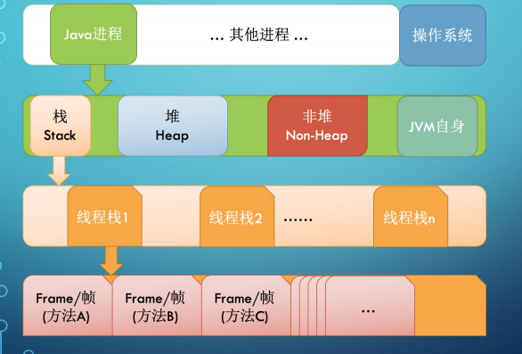
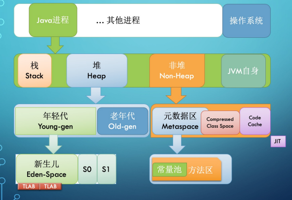
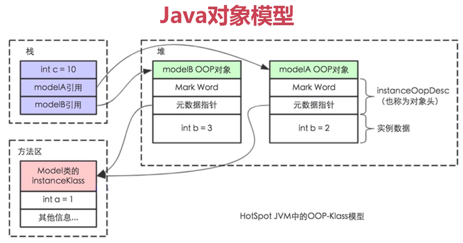
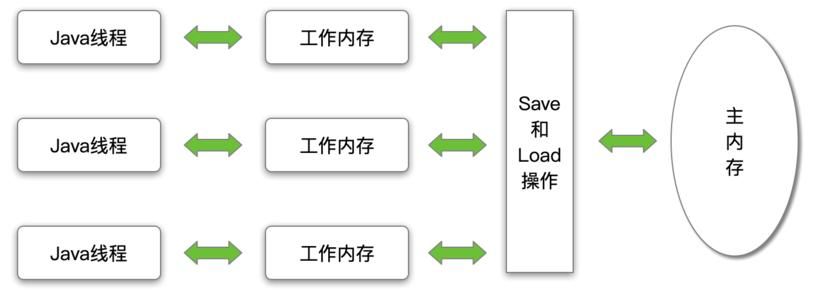
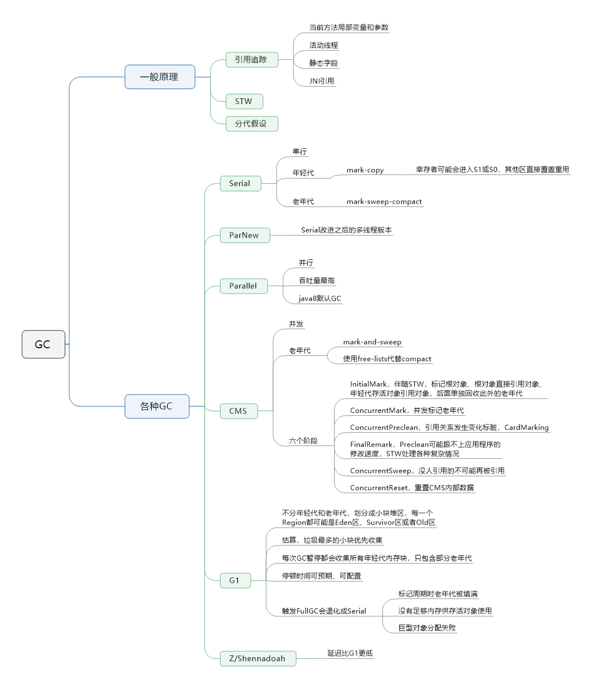
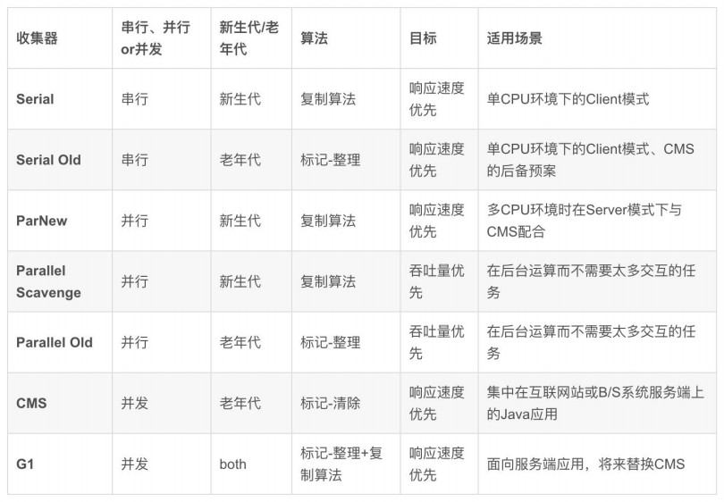

学习笔记

### JVM基础

JVM是一台基于栈的计算机器，每个线程都有一个线程栈。

每次方法调用，都会在栈里创建一个栈帧，递归调用容易导致资源耗尽。

栈帧由操作数栈，局部变量数组和一个Class引用组成。

字节码由单字节（byte）指令构成，理论上支持2^8=256个操作码，字节码分为四大类：
- 栈操作指令
- 程序流程控制指令，包括与局部变量交互
- 对象操作指令，包括方法调用
- 算术运算及类型转换指令，JVM操作最小类型是int，比int短也当作int

使用 `javac` 命令将 `.java` 源代码编译成 `.class` 字节码
- `-g` 生成调试信息，包括本地变量表

使用 `javap` 命令分析 `.class` 字节码
- `-c` 反汇编
- `-v` 输出附加信息，包括版本号、常量池、行号等

简单看几个操作码：
- `invokestatic` 调用静态方法
- `invokespecial` 调用构造函数
- `invokeinterface` 调用接口方法
- `invokedynamic` 方法动态执行，jdk7新增，lambda表达式的实现基础
- `invokevirtual` 调用虚方法及没有指定操作码的其他所有方法（例如常见的实例方法）
- `aload` 从局部变量表的相应位置装载一个对象引用到栈顶；`iload`加载int...
- `aaload` 栈顶的数组下标（index）、数组引用（arrayref）出栈，并根据这两个数值取出对应的数组元素值（value）进栈；`iaload` 指定的int型数组的指定下标处的值进栈...

为了压缩字节码文件大小，也因为一个栈帧中用到的局部变量一般也就几个，所以提供了 `aload_0` 、 `aload_1` 这些指令。

例如指令 `new #2` 对应十六进制 `bb 00 02`，操作码只占一个字节，而操作数占了两个字节，有点浪费。

```
public class HelloByteCode {

    public static void main(String[] args) {
        HelloByteCode obj = new HelloByteCode();
    }

}
```

将上述文件编译成字节码：

```
Classfile /C:/Users/gujie/IdeaProjects/untitled/src/HelloByteCode.class
  Last modified 2021-1-7; size 415 bytes
  MD5 checksum 2d8d7d53684d2f9c26f99906ccad33e6
  Compiled from "HelloByteCode.java"
public class HelloByteCode
  minor version: 0
  major version: 52
  flags: ACC_PUBLIC, ACC_SUPER
Constant pool:
   #1 = Methodref          #4.#19         // java/lang/Object."<init>":()V
   #2 = Class              #20            // HelloByteCode
   #3 = Methodref          #2.#19         // HelloByteCode."<init>":()V
   #4 = Class              #21            // java/lang/Object
   #5 = Utf8               <init>
   #6 = Utf8               ()V
   #7 = Utf8               Code
   #8 = Utf8               LineNumberTable
   #9 = Utf8               LocalVariableTable
  #10 = Utf8               this
  #11 = Utf8               LHelloByteCode;
  #12 = Utf8               main
  #13 = Utf8               ([Ljava/lang/String;)V
  #14 = Utf8               args
  #15 = Utf8               [Ljava/lang/String;
  #16 = Utf8               obj
  #17 = Utf8               SourceFile
  #18 = Utf8               HelloByteCode.java
  #19 = NameAndType        #5:#6          // "<init>":()V
  #20 = Utf8               HelloByteCode
  #21 = Utf8               java/lang/Object
{
  public HelloByteCode();
    descriptor: ()V
    flags: ACC_PUBLIC
    Code:
      stack=1, locals=1, args_size=1
         0: aload_0
         1: invokespecial #1                  // Method java/lang/Object."<init>":()V
         4: return
      LineNumberTable:
        line 1: 0
      LocalVariableTable:
        Start  Length  Slot  Name   Signature
            0       5     0  this   LHelloByteCode;

  public static void main(java.lang.String[]);
    descriptor: ([Ljava/lang/String;)V
    flags: ACC_PUBLIC, ACC_STATIC
    Code:
      stack=2, locals=2, args_size=1
         0: new           #2                  // class HelloByteCode
         3: dup
         4: invokespecial #3                  // Method "<init>":()V
         7: astore_1
         8: return
      LineNumberTable:
        line 4: 0
        line 5: 8
      LocalVariableTable:
        Start  Length  Slot  Name   Signature
            0       9     0  args   [Ljava/lang/String;
            8       1     1   obj   LHelloByteCode;
}
SourceFile: "HelloByteCode.java"
```

### 类的初始化时机

这里所说的“初始化”不一定包括动态代码块和动态变量，那些会在实例化的时候才进行。
一句话总结就是“用到的时候才会初始化”。
获取Class对象或者定义一个指定类型的引用等操作的时候，实际上并没有开始使用，只是加载而不初始化。

- 当虚拟机启动时，初始化用户指定的主类，就是启动执行的 main 方法所在的类。
- new指令实例化一个类
- 调用静态方法
- 访问静态字段
- 子类的初始化会触发父类的初始化
- 如果一个接口定义了 default 方法，实现类初始化会触发接口初始化
- 反射调用某个类
- 调用 MethodHandle 实例

### 类的生命周期

1. 加载（Loading） 找Class文件
1. 连接
	1. 验证（Verification） 验证格式、依赖
	1. 准备（Preparation） 静态变量分配内存赋默认值、方法表
	1. 解析（Resolution） 常量池中的符号解析为引用
1. 初始化（Initialization）先父后子
	1. 静态代码块、变量（只一次）
	1. 动态代码块、变量
	1. 构造函数
1. 使用（Using）
1. 卸载（Unloading）

看一道题目：

```
public class Alibaba {

    public static int k = 0;
    public static Alibaba t1 = new Alibaba("t1");
    public static Alibaba t2 = new Alibaba("t2");
    public static int i = print("i");
    public static int n = 99;
    private int a = 0;
    public int j = print("j");
    {
        print("构造块");
    }
    static {
        print("静态块");
    }

    public Alibaba(String str) {
        System.out.println((++k) + ":" + str + "   i=" + i + "    n=" + n);
        ++i;
        ++n;
    }

    public static int print(String str) {
        System.out.println((++k) + ":" + str + "   i=" + i + "    n=" + n);
        ++n;
        return ++i;
    }

    public static void main(String args[]) {
        Alibaba t = new Alibaba("init");
    }
}
```

准备阶段静态变量i和n已经赋了初值0，

静态变量赋值和静态代码块已经开始执行，只会执行一次，

所以t1和t2创建对象的时候只会执行动态代码和构造函数，

按照静态（只一次）、动态、构造的顺序依次执行，可以推算出结果如下：

```
:j   i=0    n=0
:构造块   i=1    n=1
:t1   i=2    n=2
:j   i=3    n=3
:构造块   i=4    n=4
:t2   i=5    n=5
:i   i=6    n=6
:静态块   i=7    n=99
:j   i=8    n=100
:构造块   i=9    n=101
:init   i=10    n=102
```

### 类加载器

种类：

1. 启动类加载器（BootstrapClassLoader） 不由Java实现，加载的是jre/lib下的核心库，可以通过sun.misc.Launcher.getBootstrapClassPath().getURLs()获取
1. 扩展类加载器（ExtClassLoader）jre/lib/ext下的扩展包 ((URLClassLoader)ClassLoader.getSystemClassLoader().getParent()).getURLs();
1. 应用类加载器（AppClassLoader）((URLClassLoader)ClassLoader.getSystemClassLoader()).getURLs();

类加载器可以通过getParent获取父加载器，这并不是继承关系，如果直接继承ClassLoader自己实现一个类加载器，且不指定父加载器，他的父加载器就是AppClassLoader

任何parent为null的加载器，其父加载器为BootstrapClassLoader

添加类的几种方式：

1. 放到JDK的lib/ext下，或者-Djava.ext.dirs
1. `java -cp` 或者 class文件放到当前路径，可以用于引入依赖，windows用;linux用:分割，`javac -cp  .:httpcore-4.4.1.jar:httpclient-4.4.1.jar:commons-logging-1.2.jar  TestIPMain.java`，解压jar包，`META-INF` 文件夹下都有 `MANIFEST.MF` 指定了 `Main-Class`，`java -jar Test.jar` 可以被 `java -cp Test.jar Main.java` 替代。
1. 使用ClassLoader或者自定义ClassLoader,JDK9之前ExtClassLoader和AppClassLoader都继承了URLClassLoader，可以通过反射调用addURL添加类,JDK9之后平级了，可以通过 `Class.forName("Test", new URLClassLoader("path:/xxx.jar"))` 添加类

特点：

1. 双亲委托，当某个特定的类加载器在接收到加载类的请求时，首先将该加载任务发送给父加载器，若父加载器仍有父亲，则继续向上追溯，直到最高级。如果最高级父加载器能够加载到该类，则成功返回，否则由其子加载器进行加载。以此类推，如果到最后一个子加载器还不能成功加载，则抛出一个异常。作用：可以保证java核心库或第三方库的安全（防止低一级加载器加载的类覆盖高级加载器加载的类）
1. 负责依赖，类加载器会去寻找当前类所依赖的其他类
1. 缓存加载，只会加载一次，后续从缓存中获取

### 三个模型

JVM内存结构





Java对象模型



Java内存模型（JMM）



### JVM参数

不带前缀的是Java规范的jvm参数，JavaAgent参数可以通过无侵入方式做很多事情，比如注入AOP代码

- `-server` 启动慢，运行时性能高
- `-client` 启动速度快，运行性能低，适合调试

#### `-D` 设置系统属性

有中文编译不了，设置-Dfile.encoding=UTF-8，获取方式：
System.getProperty("file.encoding");

#### `-X` 非标准参数

- `-Xlint` 解释运行
- `-Xcomp` 编译运行
- `-Xmixed` 混合模式，也是默认模式
- `Xms` 堆内存初始大小
- `Xmx` 最大堆内存
- `Xmn` 新生代大小，等价 `-XX:NewSize`
- `Xss` 每个线程栈的字节数，等价 `与-XX:ThreadStackSize`
- `Xdebug` 远程调试

#### `-XX` 非稳定参数

- +-表示boolean 
- `-XX:+HeapDumpOnOutOfMemoryError`、`-XX:HeapDumpPath=/usr/local` 当OutOfMemoryError产生，自动dump堆内存
- `-XX:OnError` 发生致命错误时，执行的脚本

### 常见GC





#### 常用GC组合

- Serial+Serial Old 实现单线程的低延迟垃圾回收机制
- ParNew+CMS 实现多线程的低延迟垃圾回收机制
- Parallel Scavenge和Parallel Old，实现多线程的高吞吐量垃圾回收机制
