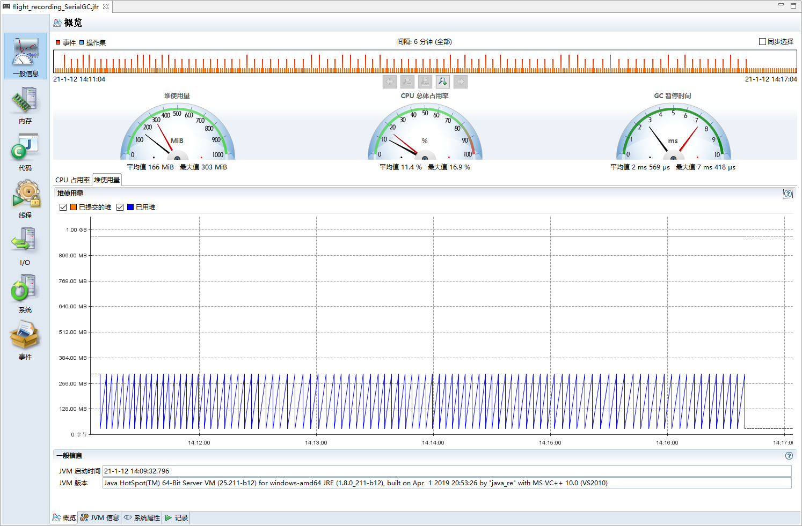
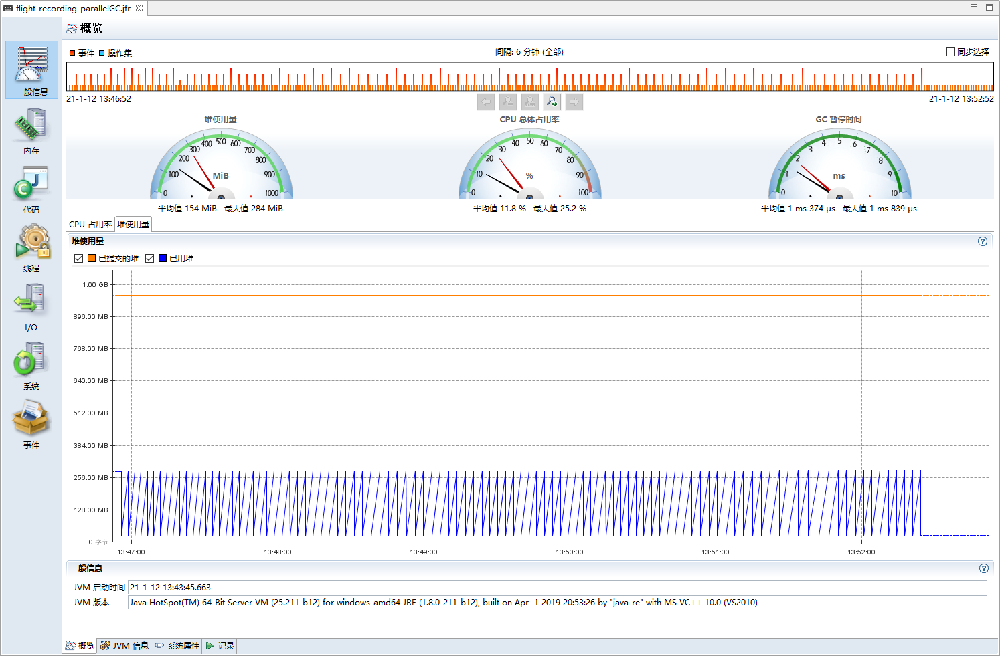
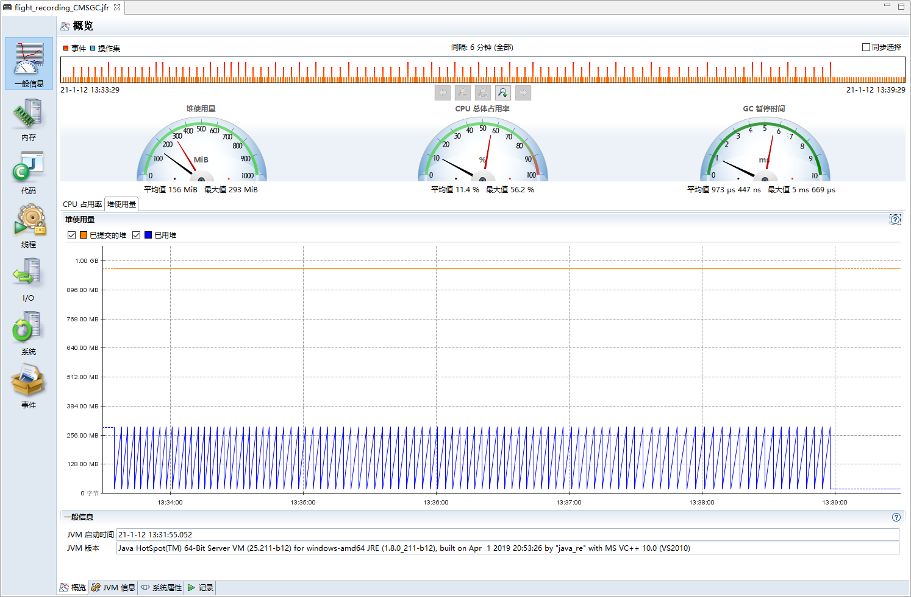
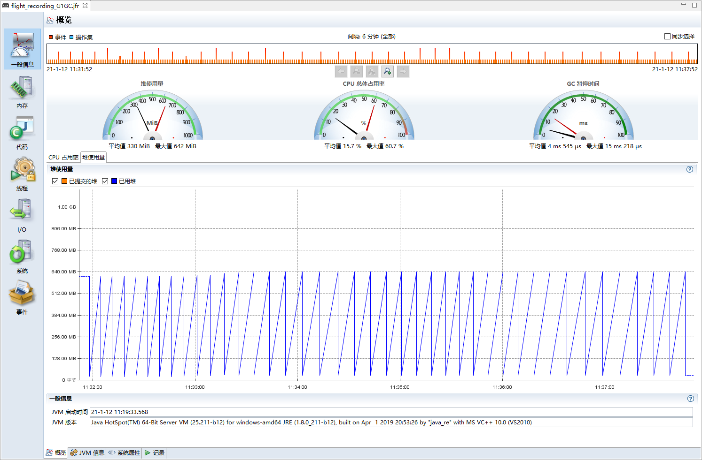

### 常用参数

JMS额外参数

-XX:+UnlockCommercialFeatures -Dcom.sun.management.jmxremote.rmi.port=8192 -Dcom.sun.management.jmxremote=true -Dcom.sun.management.jmxremote.port=8192 -Dcom.sun.management.jmxremote.ssl=false -Dcom.sun.management.jmxremote.authenticate=false -Djava.rmi.server.hostname=localhost

windows不能在powershell下运行，会报加载不到类

-XX:NewRatio NewSize:OldSize

-XX:SurvivorRatio Eden:Survivor

### 常用命令

`jps` 看进程，`jmap -heap` 看堆内存配置，`jstat -gcutil` 看堆内存使用比率

### SerialGC



java -Xms1g -Xmx1g -XX:-UseAdaptiveSizePolicy -XX:+UseSerialGC -jar .\gateway-server-0.0.1-SNAPSHOT.jar

MaxHeapSize:NewSize:OldSize 1024:341:682 = 3:1:2

Eden:Survivor 273:34 = 8:1

### ParallelGC



java -Xms1g -Xmx1g -XX:-UseAdaptiveSizePolicy -XX:+UseParallelGC -jar .\gateway-server-0.0.1-SNAPSHOT.jar

MaxHeapSize:NewSize:OldSize 1024:341:682 = 3:1:2

Eden:Survivor 256:42 = 6:1

jmap虽然显示SurvivorRatio=8，实际比例并不是8，需要加上参数 `-XX:SurvivorRatio=8` 才是8

### CMSGC



java -Xms1g -Xmx1g -XX:-UseAdaptiveSizePolicy -XX:+UseConcMarkSweepGC -jar .\gateway-server-0.0.1-SNAPSHOT.jar

MaxHeapSize:NewSize:OldSize 1024:341:682 = 3:1:2

Eden:Survivor 273:34 = 8:1

很奇怪，我启动的GMC并没有出现老师演示的那种按照线程数初始化的情况，默认值也不想纠结，具体问题具体分析

```
Heap Configuration:
   MinHeapFreeRatio         = 40
   MaxHeapFreeRatio         = 70
   MaxHeapSize              = 1073741824 (1024.0MB)
   NewSize                  = 357892096 (341.3125MB)
   MaxNewSize               = 357892096 (341.3125MB)
   OldSize                  = 715849728 (682.6875MB)
   NewRatio                 = 2
   SurvivorRatio            = 8
   MetaspaceSize            = 21807104 (20.796875MB)
   CompressedClassSpaceSize = 1073741824 (1024.0MB)
   MaxMetaspaceSize         = 17592186044415 MB
   G1HeapRegionSize         = 0 (0.0MB)
```

### G1GC



java -Xms1g -Xmx1g -XX:-UseAdaptiveSizePolicy -XX:+UseG1GC -jar .\gateway-server-0.0.1-SNAPSHOT.jar

G1 Young Generation由 Eden Space和 Survivor Space 构成，合起来645，剩下379的给G1 Old Generation，一开始老年代的regions是0，压测次数多了才会初始化老年代，老年代只占少数，各个区域所占的regions都是动态变化的

```
Heap Usage:
G1 Heap:
   regions  = 1024
   capacity = 1073741824 (1024.0MB)
   used     = 647169496 (617.1889266967773MB)
   free     = 426572328 (406.81107330322266MB)
   60.27235612273216% used
G1 Young Generation:
Eden Space:
   regions  = 591
   capacity = 672137216 (641.0MB)
   used     = 619708416 (591.0MB)
   free     = 52428800 (50.0MB)
   92.1996879875195% used
Survivor Space:
   regions  = 4
   capacity = 4194304 (4.0MB)
   used     = 4194304 (4.0MB)
   free     = 0 (0.0MB)
   100.0% used
G1 Old Generation:
   regions  = 23
   capacity = 397410304 (379.0MB)
   used     = 23266776 (22.188926696777344MB)
   free     = 374143528 (356.81107330322266MB)
   5.854598073028323% used
```