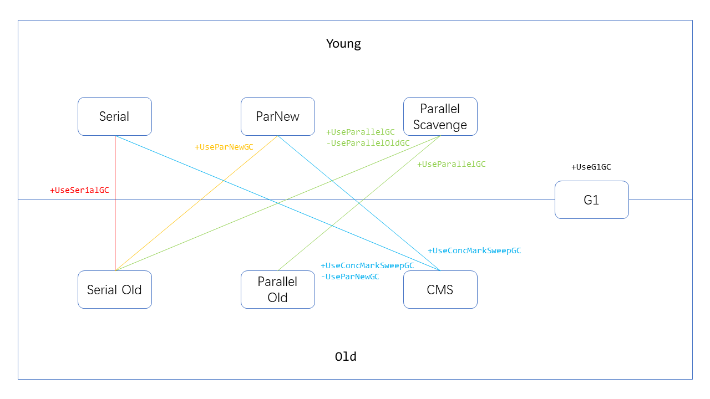

### 堆内存

Java堆是被所有线程共享的一块内存区域，所有对象和数组都在堆上进行分配。

对象包含三部分：

- 对象头：
标记字（1byte）、Class指针（1byte）、数组长度（int）。

- 实例数据：
属性字段。

- 对齐填充：
为了高效寻址，空间换时间。

常见的占内存：

- 包装类型

- 多维数组：存放嵌套数组的引用占额外的空间。

- String：可以用char[]代替。

GC的一般原理包括：

- 引用追踪：
Java不能直接操作内存，不被引用的垃圾肯定不会再被使用。

- 分代假设：
大部分新生对象很快无用，存活时间久的对象可能存活更长时间。基于这种特性，将内存划分为新生代和老年代进行管理，`Minor GC` 一般要比 `Major GC` 频繁得多。

- STW：
GC暂停主要为了防止两种情况：1、标记过程中，某个对象不被依赖了，但是已经被标记过了，该回收的没回收；2、标记过程中，某些新对象依赖旧对象，但是旧对象已经遍历过了，这些新对象不会再被标记，不该回收的回收了。随着屏障技术和GC算法的发展，STW的时间会越来越短。

PrintGCDetails的分析
- 复制日志信息，使用GC easy等工具分析。

- 分配速率：
每次GC，年轻代新增的使用量除以时间间隔。如果分配速率很高甚至大于回收速率，很有可能导致GC开销大甚至OOM。

- 提升速率：
每次GC，从年轻代提升到老年代的数量除以时间间隔。提升速率很高可能是to区太小、大对象、存活次数阈值小导致的。老年代填充越快，`Major GC`发生的频率越高。



上图介绍了JVM参数与各个GC收集器的对应关系，下面简要介绍涉及的几个收集器。

### 新生代

- Serial：
复制算法，eden + from -> to。

- ParNew：
Serial的多线程版本。

- Parallel Scavenge：
也是复制算法，并行处理，但是可以设置 `MaxGCPauseMills` 和 `GCTimeRatio`，最大允许1/(1+n)的垃圾收集时间，默认值是99，也就是1%，此收集器关注吞吐量。还可以设置 `+UseAdaptiveSizePolicy` 让虚拟机自动调整 `Xmn`、`SurvivorRatio` 和 `PretenureSizeThreshold` 等细节参数达到预设的吞吐量和停顿时间。

### 老年代

- Serial Old：
标记清除整理。

- Parallel Old：
同样是标记清除整理，但是并行，与Paralle Scavenge一样更关注吞吐量而非GC暂停时间。

- CMS：
第一款真正意义上的并发收集器，实现了垃圾收集线程和用户线程同时工作。使用标记清除算法，用空闲列表来管理零散的内存空间，也可以使用 `+UseCMSCompactAtFullCollection` 对内存进行压缩整理，但是会导致STW更长。分为6个阶段：初始标记->并发标记->并发预清理（标脏）->最终标记->并发清除->并发重置。如果CMS运行期间内存无法满足程序需要，就会出现 `Concurrent Mode Failure`，临时启动Serial Old重新处理老年代。

### G1GC
垃圾优先，STW时间可预期可配置。将划分成多个小块堆区域，每个小块，可以在Eden区、Survivor区和Old区之间转换。增量处理，垃圾多的小块会被优先收集。

#### Remembered Set
每个内存块都对应一个RS，保存了Old块对此块的引用，Eden和Survivor每次在YoungGC和OldGC的时候分别会被扫描，不用考虑。JVM在赋值引用 `object.field=object` 的时候会更新RS，使用队列 `dirty card queue`，性能比线程同步好。

#### SATB（Snapshot At The Begging）
```java
A.c = null;
B.c = C;
// GC线程扫A
A.c = B.c;
B.c = null;
// GC线程扫B
```
对象C被A引用着，但是没标记到，所以引用赋值null的时候会将原对象C保存到一个队列，可能存活，重新标记STW的时候再处理，称为开始快照技术。

G1的垃圾回收过程：

1. 年轻代转移暂停：
初始没有足够信息，处于fully-young模式，Eden用满后，应用线程暂停，存活对象拷贝到存活区。扫描根->更新RS->处理RS->复制对象->处理引用。

1. 老年代并发标记：
年轻代回收STW->并发标记老年代->重新标记STW->回收百分百为垃圾的块。

1. 混合转移暂停：
不止清理年轻代，还将一部分老年代区域（不是百分百垃圾）也回收。

1. Full GC：
上述方式不能正常工作，用SerialGC回收。
