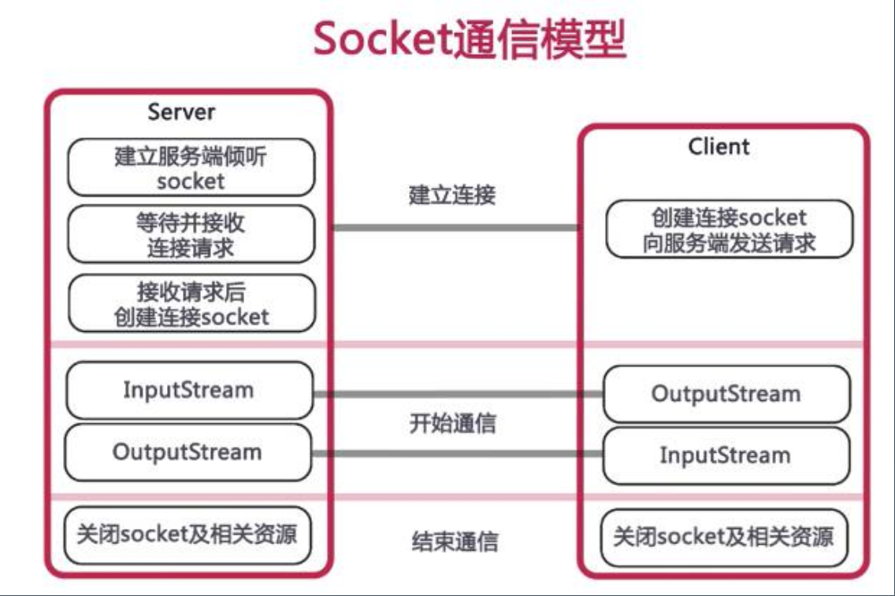
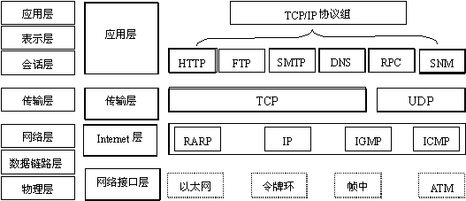

NIO是什么？

要从普通的IO socket讲起，最初的网络IO是同步阻塞的IO模型，效率较低。所以才出现了非阻塞的NIO。阻塞与非阻塞的区别本文后面会讲到。

##  1、Java Socket 编程*:如何基于 Socket 实现 Server 

### 服务器通信原理



要了解socket是什么，需要先了解TCP/IP。

### TCP/IP是什么？

​	单台计算机设备中的应用程序可以通过进程id(pid)进行通信，但是在网络中就行不通了。TCP/TP协议就是为了解决这一问题，网络层的“ip地址”可以唯一表示网络中的主机，而传输层的“协议+端口”可以唯一标识主机中的进程。这样，利用协议、ip、端口就可以标识网络中的进程，这些进程就可以利用这个标识与其他进行通信交互。

​	上面的例子告诉我们TCP/IP是用来干什么的，即它是用来让网络之间的进程通信时使用的。那么什么是TCP/IP？TCP/IP*（*Transmission Control Protocol/Internet Protocol*）即传输控制协议*/网间协议，是一个工业标准的协议集，它是为广域网（WANs）设计的。它定义了主机如何连入因特网及数据如何在它们之间传输的标准。

​	从字面意思来看TCP/IP是TCP和IP协议的合称，但实际上TCP/IP协议是指因特网整个TCP/IP协议族。不同于ISO模型的七个分层，TCP/IP协议参考模型把所有的TCP/IP系列协议归类到四个抽象层中：

* 应用层：TFTP，HTTP，SNMP，FTP，SMTP，DNS，Telnet 等等
* 运输层：TCP，UDP
* 网络层：IP，ICMP，IGMP
* 数据链路层：SLIP，CSLIP，PPP，MTU

每一抽象层建立在低一层提供的服务上，并且为高一层提供服务，看起来大概是这样子的。


IOS参考模型和TCP/IP模型的对比：

​	

​	看完上面的图表，对TCP/IP协议族应该有了一个大概的了解，它是指涉及到通讯过程中的一系列的协议，包括网络接口处，网络层，传输层的协议。

​	为什么要将网络通讯划分成这么多层次呢？因为它比较复杂，如果只用一个层来实现整个通讯流程，那么这个层次会非常复杂，既不利于维护，也不利于扩展。从软件工程的角度来考虑这个问题就很好理解了。

​	不得不说最开始设计TCP/IP的人真是天才啊，知道要分层很容易想到，但是如何分层又是一个大问题，最早的那批先辈们帮我们解决了这个问题。我们现在只需要学习各个分层的作用就可以了。

###  什么是Socket？

Socket的中文翻译过来就是“套接字”。套接字是什么，我们先来看看它的英文含义：插座。

Socket就像一个电话插座，负责连通两端的电话，进行点对点通信，让电话可以进行通信，端口就像插座上的孔，端口不能同时被其他进程占用。而我们建立连接就像把插头插在这个插座上，创建一个Socket实例开始监听后，这个电话插座就时刻监听着消息的传入，谁拨通我这个“IP地址和端口”，我就接通谁。

**实际上，Socket是在应用层和传输层之间的一个抽象层，它把TCP/IP层复杂的操作抽象为几个简单的接口，供应用层调用实现进程在网络中的通信。**Socket起源于UNIX，在Unix一切皆文件的思想下，进程间通信就被冠名为文件描述符（file desciptor），Socket是一种“打开—读/写—关闭”模式的实现，服务器和客户端各自维护一个“文件”，在建立连接打开后，可以向文件写入内容供对方读取或者读取对方内容，通讯结束时关闭文件。

另外我们经常说到的Socket所在位置如下图：


### java使用socket实现简单的HTTP服务器

* 单线程

```java
public class HttpServer01 {
    public static void main(String[] args) throws IOException{
        ServerSocket serverSocket = new ServerSocket(8801);
        while (true) {
            try {
                Socket socket = serverSocket.accept();
                service(socket);
            } catch (IOException e) {
                e.printStackTrace();
            }
        }
    }
    
    private static void service(Socket socket) {
        try {
//            Thread.sleep(5);
            PrintWriter printWriter = new PrintWriter(socket.getOutputStream(), true);
            printWriter.println("HTTP/1.1 200 OK");
            printWriter.println("Content-Type:text/html;charset=utf-8");
            String body = "hello,nio";
            printWriter.println("Content-Length:" + body.getBytes().length);
            printWriter.println();
            printWriter.write(body);
            printWriter.close();
            socket.close();
        } catch (IOException e) { // | InterruptedException e) {
            e.printStackTrace();
        }
    }
}
```

* 多线程

```java
public static void main(String[] args) throws IOException{
  ServerSocket serverSocket = new ServerSocket(8802);
  while (true) {
    try {
      final Socket socket = serverSocket.accept();
      new Thread(() -> {
        service(socket);
      }).start();
    } catch (IOException e) {
      e.printStackTrace();
    }
  }
}
```


* 多线程-线程池

```java
public static void main(String[] args) throws IOException{

  ExecutorService executorService = Executors.newFixedThreadPool(
    Runtime.getRuntime().availableProcessors() + 2);
  final ServerSocket serverSocket = new ServerSocket(8803);
  while (true) {
    try {
      final Socket socket = serverSocket.accept();
      executorService.execute(() -> service(socket));
    } catch (IOException e) {
      e.printStackTrace();
    }
  }
}
```

​	分别用wrk压测，对比三种实现，单线程只能串行处理，多线程多出了线程创建、删除的开销，，线程池最好。

## 2、 深入讨论 IO**:Server 处理时到底发生了什么

上面的socket的例子，请求过程中，存在两种类型操作:
* CPU 计算/业务处理（业务处理）

- IO 操作与等待/网络、磁盘、数据库（查询db、response）

#### 普通的socket网络请求存在哪些问题？

1、磁盘、IO与CPU之间速度有数量级差距。

2、应用想读写数据需要数据在内核缓冲区和用户进程缓冲区之间来回拷贝数据。

> 为什么应用程序想读写数据时需要在内核缓冲区和用户进程缓冲区之间来回拷贝数据？
>
> 请参考->[<<用户进程缓冲区和内核缓冲区>>](为什么需要用户进程缓冲区和内核缓冲区.md)

详解如下：

#### 1) 磁盘、IO与CPU之间速度有数量级差距，为什么使用线程池比单线程速度快？

因为当处理一个请求时，因为CPU比IO快很多个数量级，在每个response过程中时，CPU是可以同时执行其他的线程的网络请求。而且对于多逻辑核服务器来说多个CPU可以并行工作。


对于一个 IO 相关应用来说，
例如通过网络访问，服务器端读取本地文件，再返回给客户端(如上图)。

* 这种情况下，大部分 CPU 等资源，可能就被浪费了。怎么优化呢?

  多个线程并发给CPU执行，其中一个线程处于磁盘或网络IO数据等待时，CPU可以先切换执行其他线程。


##### HttpServer01单线程处理请求并发性能差的原因分析：

serverSocket执行过程：	

​	1、serverSocket调用accept方法，监听其他客户端的请求数据时，底层会调用recvfrom函数，发起系统调用向内核请求数据，**内核会一直等待网卡接收数据，此时此应用线程会一直阻塞等待**；

​	2、当内核缓冲区准备好数据时，CPU将数据内核缓冲区复制到用户缓冲区，复制过程，**此用户线程仍然处于阻塞状态直到复制完成**。

​	3、serverSocket所在线程继续执行业务逻辑。response数据给客户端。此过程仍然与1、2过程相同，只是方向相反。

分析单线程可能导致的瓶颈点：1、执行过程中1、2、3中有request和response都有等待网卡发送/接收数据和缓冲区数据拷贝等IO耗时操作，由于CPU本身就比内存速度快几个数量级，所以即使是单核CPU，CPU资源也没有得到充分利用。


#### 2)    内核缓冲区和用户进程缓冲区数据来回复制的问题

网络中的数据通过网卡，会先传到内核空间的数据缓冲区。然后用户进程的数据缓冲区需要从内核缓冲区中拷贝数据后才能使用数据。


##### HttpServer01、HttpServer02、HttpServer03 存在缓冲区拷贝时线程阻塞时间长的问题

serverSocket执行过程：	

​	1、serverSocket调用accept方法，监听其他客户端的请求数据时，底层会调用recvfrom函数，发起系统调用向内核请求数据，**内核会一直等待网卡接收数据，此时此应用线程会一直阻塞等待**；

​	2、当内核缓冲区准备好数据时，CPU将数据内核缓冲区复制到用户缓冲区，复制过程，**此用户线程仍然处于阻塞状态直到复制完成**。

​	3、serverSocket所在线程继续执行业务逻辑。response数据给客户端。此过程仍然与1、2过程相同，只是方向相反。

分析缓冲区复制导致的性能问题：

​		serverSocket在request和response时都会发生内核缓冲区和用户进程缓冲区数据来回复制，是较为耗时的IO操作。


####  考虑一下，理想状态，是什么样的?

**我的理解**，根据上面的两个问题分析得出

​	1、使用多线程提高CPU的利用率；

​	2、使用多线程将socket通信过程职责分工给多个线程；(流水线模型)

​	3、优化掉用户缓冲区与内核缓冲区的拷贝。让用户进程可以直接操作内核缓冲区。

​	4、去掉阻塞，提高线程和CPU利用率。

## 3、 IO 模型与相关概念*:怎么理解 NIO

### IO模型类型：同步/异步、阻塞/非阻塞的含义

>  同步/异步、阻塞/非阻塞的含义：
>
> 妈妈让我去厨房烧一锅水，准备下饺子
> 阻塞：水只要没烧开，我就干瞪眼看着这个锅，沧海桑田，日新月异，我自岿然不动，厨房就是我的家，烧水是我的宿命。
>
> 非阻塞：我先去我屋子里打把王者，但是每过一分钟，我都要去厨房瞅一眼，生怕时间长了，水烧干了就坏了，这样导致我游戏也心思打，果不然，又掉段了。
>
> 同步：不管是每分钟过来看一眼锅，还是寸步不离的一直看着锅，只要我不去看，我就不知道水烧好没有，浪费时间啊，一寸光阴一寸金，这锅必须发我13薪
>
> 异步：我在淘宝买了一个电水壶，只要水开了，它就发出响声，嗨呀，可以安心打王者喽，打完可以吃饺子喽~
>
> 总结：
> 阻塞/非阻塞：我在等你干活的时候我在干啥？
> 阻塞：啥也不干，死等
> 非阻塞：可以干别的，但也要时不时问问你的进度
> 同步/异步：你干完了，怎么让我知道呢？
> 同步：我只要不问，你就不告诉我
> 异步：你干完了，直接喊我过来就行
>
> 参考：https://www.jianshu.com/p/486b0965c296

### 五种IO模型


其他的IO模型因为缓冲区复制数据不是异步的，所以不算异步I/O。

其中异步I/O模型（AIO）指的是纯异步。因为用户进程不需要主动从内核缓冲区拷贝数据。数据拷贝完成后，会自动通知用户进程。

### BIO


​	阻塞式 IO、BIO，一般通过在 while(true) 循环中服务 端会调用 accept() 方法等待接收客户端的连接的方式监听请求，请求一旦接收到一个连接请求，就可以建立通信套接字在这个通信套接字上进行读写操作，此时不能再接收其他客户端连接请求，只能等待同当前连接的 客户端的操作执行完成， 不过可以通 过多线程来支持多个客户端的连接


---


### NIO


和阻塞 IO 类比，内核会立即返回， 返回后获得足够的 CPU 时间继续做其它的事情。
用户进程第一个阶段不是阻塞的,需要不断的主动询问 kernel 数据好了没有;第二个阶段(缓冲区复制)依然总是阻塞的。


### IO 多路复用


​	IO 多路复用(IO multiplexing)，也称事件驱动 IO(event-driven IO)，就是在单 个线程里同时监控多个套接字，通过 select 或 poll 轮询所负责的所有 socket，当某个 socket 有数据到达了， 就通知用户进程。
​	IO 复用同非阻塞 IO 本质一样，不过利 用了新的 select 系统调用，由内核来负 责本来是请求进程该做的轮询操作。看 似比非阻塞 IO 还多了一个系统调用开销， 不过因为可以支持多路 IO，才算提高了 效率。
​	进程先是阻塞在 select/poll 上，再是阻塞在读操作的第二个阶段上。


select/poll 的几大缺点:
	(1)每次调用 select，都需要把 fd 集合从用户态拷⻉到 内核态，这个开销在 fd 很多时会很大

​	(2)同时每次调用 select 都需要在内核遍历传递进来的 所有 fd，这个开销在 fd 很多时也很大

​	(3)select 支持的文件描述符数量太小了，默认是1024
epoll(Linux 2.5.44内核中引入,2.6内核正式引入,可被用 于代替 POSIX select 和 poll 系统调用):
​	(1)内核与用户空间共享一块内存 

​	(2)通过回调解决遍历问题

​	(3)fd 没有限制，可以支撑10万连接


### 信号驱动IO


​	信号驱动 IO 与 BIO 和 NIO 最大的 区别就在于，在 IO 执行的数据准备 阶段，不会阻塞用户进程。
​	如图所示:当用户进程需要等待数据 的时候，会向内核发送一个信号，告 诉内核我要什么数据，然后用户进程 就继续做别的事情去了，而当内核中 的数据准备好之后，内核立⻢发给用户进程一个信号，说”数据准备好了， 快来查收“，用户进程收到信号之后， 立⻢调用 recvfrom，去查收数据。

线程池->EDA->SEDA：


### AIO


​	异步 IO 真正实现了 IO 全流程的非阻 塞。用户进程发出系统调用后立即返 回，内核等待数据准备完成，然后将 数据拷⻉到用户进程缓冲区，然后发 送信号告诉用户进程 IO 操作执行完 毕(与 SIGIO 相比，一个是发送信号 告诉用户进程数据准备完毕，一个是 IO执行完毕)。
​	windows 的 IOCP 模型


## 4、 Netty 框架简介:什么是 Netty

### netty

网络应用开发框架。异步、事件驱动、基于NIO

### netty应用场景

服务端、客户端、TCP/UDP

### 基本概念

Channel

​	通道，Java NIO 中的基础概念,代表一个打开的连接,可执行读取/写入 IO 操作。 Netty 对 Channel 的所有 IO 操作都是非阻塞的。

ChannelFuture 

​	Java 的 Future 接口，只能查询操作的完成情况, 或者阻塞当前线程等待操作完 成。Netty 封装一个 ChannelFuture 接口。我们可以将回调方法传给 ChannelFuture，在操作完成时自动执行。

Event & Handler

​	Netty 基于事件驱动，事件和处理器可以关联到入站和出站数据流。

Encoder & Decoder

​	处理网络 IO 时，需要进行序列化和反序列化, 转换 Java 对象与字节流。 对入站数据进行解码, 基类是 ByteToMessageDecoder。 对出站数据进行编码, 基类是 MessageToByteEncoder。

ChannelPipeline

​	数据处理管道就是事件处理器链。有顺序、同一 Channel 的出站处理器和入站处理器在同一个列表中。

事件处理程序接口:
􏰀 ChannelHandler
􏰀 ChannelOutboundHandler
􏰀 ChannelInboundHandler 适配器(空实现，需要继承使用):
􏰀 ChannelInboundHandlerAdapter
􏰀 ChannelOutboundHandlerAdapter

入站事件:
􏰀 通道激活和停用 􏰀 读操作事件
􏰀 异常事件
􏰀 用户事件 出站事件:
􏰀 打开连接
􏰀 关闭连接
􏰀 写入数据
􏰀 刷新数据

## 5、 Netty 使用示例*:如何使用 Netty 实现 NIO 

