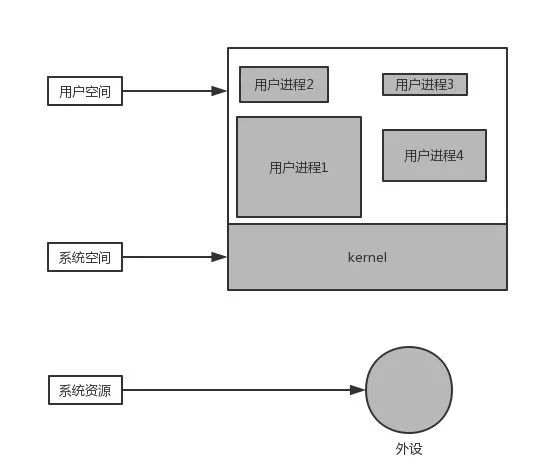
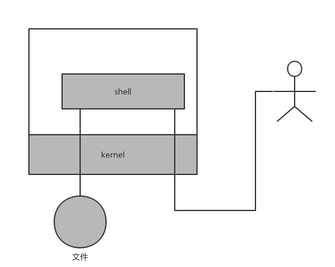
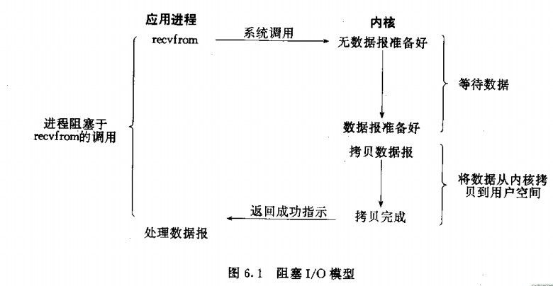
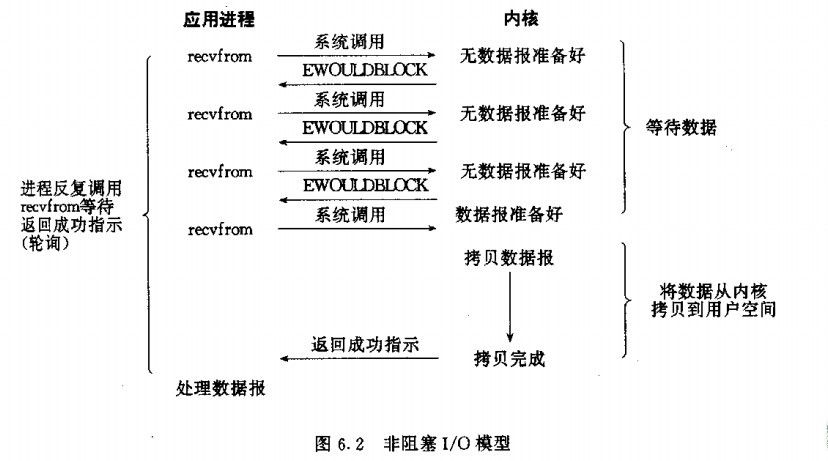

　　常常听到有程序员会跟你讨论：“我们在读写文件的时候，系统是有缓存的”。但实际上有一部分人把用户进程缓存区和系统空间缓存区的概念混淆了，包括这两种缓冲区的用法和所要解决的问题，还有其它类似的概念。本文就来区分一下不同的缓冲区概念（主要针对类unix平台）。

　　用户进程和操作系统的关系，首先我用一张图来解释“用户进程和操作系统的关系

　这是一个计算机系统运行时的简化模型，我们把所有运行在操作系统上的进程称为用户进程，它们都运行在用户空间（可以看到用户空间有很多进程）。把操作系统运行的空间成为系统空间

　　为什么将进程分为用户进程和系统进程，首先你一定听说过**内核态和用户态（kernel mode和user mode）**，在内核态可以访问系统资源，比如：

​	**处理器cpu**：cpu控制着一个程序的执行。

​	**输入输出IO**：linux有句话叫“一切都是流”，也就是所有输入输出设备的数据，包括硬盘，内存，终端都可以像流一样操作。

​	**进程管理**：类似对进程的创建，休眠，唤醒，释放之类的调度。比如linux下的fork和windows下的CreateProcess()函数。

​	**内存**：包括内存的申请，释放等管理操作。

​	**设备**：这个就是常常说的外设了，比如鼠标，键盘。

​	**计时器**：计算机能计时是因为晶体振荡器产生的电磁脉冲。那么所有的定时任务都是以它为基础的。

​	**进程间通信IPC**：进程之间是不能够互相访问内存的，所以进程与进程之间的交互需要通信，而通信也是一种资源。

​	**网络通信**：网络通信可以看做是进程间通信的特殊形式。

　而上面所说的这些系统资源，在用户进程中是无法被直接访问的，只能通过操作系统来访问，所以也把操作系统提供的这些功能称为:“系统调用”。

​	比如下图，展示一个用户通过shell控制计算机所经过的数据流向：文件读写和终端控制，都是通过内核进行的。

​	

​	提供这些限制的基础就是cpu提供的内核态和用户态。比如intel x86 CPU有四种不同的执行级别0-3，linux只使用了其中的0级和3级分别来表示内核态和用户态。

　　在用户态，不仅仅是系统资源了，就是别的进程的内存对于你来说，都是“透明的”（并不是没办法访问，否则游戏作弊器怎么实现？）

​	

### 用户进程缓冲区

前面提到，用户进程通过系统调用访问系统资源的时候，需要切换到内核态，而这对应一些特殊的堆栈和内存环境，必须在系统调用前建立好。而在系统调用结束后，cpu会从核心模式切回到用户模式，而堆栈又必须恢复成用户进程的上下文。而这种切换就会有大量的耗时。

你看一些程序在读取文件时，会先申请一块内存数组，称为buffer，然后每次调用read，读取设定字节长度的数据，写入buffer。（用较小的次数填满buffer）。之后的程序都是从buffer中获取数据，当buffer使用完后，在进行下一次调用，填充buffer。所以说：用户缓冲区的目的是为了减少系统调用次数，从而降低操作系统在用户态与核心态切换所耗费的时间。除了在进程中设计缓冲区，内核也有自己的缓冲区。

### 内核缓冲区

当一个用户进程要从磁盘读取数据时，内核一般不直接读磁盘，而是将内核缓冲区中的数据复制到进程缓冲区中。

但若是内核缓冲区中没有数据，内核会把对数据块的请求，加入到请求队列，然后把进程挂起，为其它进程提供服务。

等到数据已经读取到内核缓冲区时，把内核缓冲区中的数据读取到用户进程中，才会通知进程，当然不同的io模型，在调度和使用内核缓冲区的方式上有所不同，下一小结介绍。

你可以认为，read是把数据从内核缓冲区复制到进程缓冲区。write是把进程缓冲区复制到内核缓冲区。当然，write并不一定导致内核的写动作，比如os可能会把内核缓冲区的数据积累到一定量后，再一次写入。这也就是为什么断电有时会导致数据丢失。所以说内核缓冲区，是为了在OS级别，提高磁盘IO效率，优化磁盘写操作。

### 用户进程缓冲区与内核缓冲区之间数据流动的示例

#### 阻塞IO模型

#### 非阻塞IO模型

​	两种IO模型都有一个阶段是将数据从内核拷贝到用户空间，指的就是数据从内核缓冲区拷贝到用户缓冲区。

#### 两者对比

　　对比阻塞和非阻塞，在阻塞io中，直到数据从内核缓冲区拷贝到用户缓冲区才通知用户进程调用完成并唤醒，而非阻塞，在轮训得知数据准备好后，数据还是在内核缓冲区中，等你去读取，这也就是说此处的数据准备好，并不代表已经读好可以被应用进程使用。

### 缓冲区（buffer）和CPU高速缓存（cache）的区别

​	缓冲区是减少调用次数，集中调用，提高系统性能。

​	CPU高速缓存（Cache Memory）是位于CPU与内存之间的临时存储器，因为cpu的计算速度要比内存的读写速度快很多，而把这些可能会被重复访问到的数据存储于cpu缓存中，就会提高读取速度。可以说缓存是cpu和内存之间的临时存储器。

　也就是说，buffer是因为减少调用次数，集中调用，提高系统性能。而cache是将读取过的数据保存起来，重新读取时若命中（找到需要的数据）就不要去读硬盘了，若没有命中就读硬盘。